# Conhecendo os dados

O **dataset Digital Payment Fraud Detection** contém informações sobre **7.500 transações digitais sintéticas**, incluindo valores, tipos de pagamento e indicadores de fraude (`fraud_label`). Ele reúne **variáveis numéricas e categóricas**, relacionadas a **comportamento, finanças, dispositivos e risco**, e é ideal para **análise exploratória**, **identificação de outliers** e **estudo de padrões de fraude** antes da aplicação de modelos preditivos. As análises foram realizadas com base no arquivo **Digital_Payment_Fraud_Detection_Dataset.csv**.

#### 🗃️ Descrição Geral do Dataset

O dataset possui **7.500 linhas** e **15 colunas**, contendo dados detalhados de cada transação, sem valores nulos ou registros duplicados de `transaction_id`.O campo `user_id` pode se repetir, já que cada usuário pode realizar múltiplas transações.  

**Colunas do dataset:**

| Coluna                    | Tipo       | Descrição                                     |  Exemplo       |
|----------------------------|------------|-----------------------------------------------|------------|
| `transaction_id`           | numérica   | ID único da transação                          |	T1       |
| `user_id`                  | numérica   | ID do usuário                                  |	U3756     |
| `transaction_amount`       | numérica   | Valor da transação                             |18758.28   |
| `transaction_type`         | categórica | Tipo de transação                              |Transfer   |
| `payment_mode`             | categórica | Método de pagamento                            |	UPI       |
| `device_type`              | categórica | Tipo de dispositivo utilizado                  |	Web       |
| `device_location`          | categórica | Localização do dispositivo                     |	Hyderabad |
| `account_age_days`         | numérica   | Idade da conta em dias                          | 895	     |
| `transaction_hour`         | numérica   | Hora da transação                               | 14	      |
| `previous_failed_attempts` | numérica   | Número de tentativas falhas anteriores         |  1        |
| `avg_transaction_amount`   | numérica   | Valor médio das transações anteriores          | 25535.84  |
| `is_international`         | categórica | Indica se a transação é internacional         |  0         |
| `ip_risk_score`            | numérica   | Score de risco associado ao IP                 |  0.718	   |
| `login_attempts_last_24h`  | numérica   | Tentativas de login nas últimas 24 horas      |  4         | 
| `fraud_label`              | categórica | Indicador de fraude (0 = não, 1 = fraudulenta)|   0.       |

#### 📊 Estatísticas Descritivas do Dataset

**Colunas numéricas principais:**

| Coluna                   | Min      | 25%       | 50%       | 75%       | Max       | Média     | Std       | Moda       | Valores ausentes |
|---------------------------|----------|-----------|-----------|-----------|-----------|-----------|-----------|------------|----------------|
| transaction_amount        | 50.58    | 12272.79  | 24715.55  | 37288.38  | 49985.90  | 24813.53  | 14434.74  | 36588.25   | 0              |
| account_age_days          | 10       | 502.75    | 1018      | 1505      | 1999      | 1006.90   | 575.63    | 1018       | 0              |
| transaction_hour          | 0        | 5         | 11        | 18        | 23        | 11.44     | 6.95      | 3          | 0              |
| previous_failed_attempts  | 0        | 1         | 2         | 3         | 4         | 2.01      | 1.42      | 4          | 0              |
| avg_transaction_amount    | 102.79   | 7725.84   | 15074.81  | 22573.06  | 29994.29  | 15129.06  | 8597.76   | 2121.88    | 0              |
| is_international          | 0        | 0         | 0         | 0         | 1         | 0.10      | 0.30      | 0          | 0              |
| ip_risk_score             | 0        | 0.257     | 0.502     | 0.759     | 1         | 0.505     | 0.29      | 0.171      | 0              |
| login_attempts_last_24h   | 1        | 3         | 5         | 7         | 9         | 4.99      | 2.59      | 1          | 0              |
| fraud_label               | 0        | 0         | 0         | 0         | 1         | 0.065     | 0.25      | 0          | 0              |

**Colunas categóricas / IDs principais:**

| Coluna             | Tipo   | Moda         | Frequência | % Frequência | Valores únicos |
|-------------------|--------|-------------|------------|--------------|----------------|
| transaction_id     | object | T1          | 1          | 0.01%        | 7500           |
| user_id            | object | U1247       | 6          | 0.08%        | 5106           |
| transaction_type   | object | Payment     | 2511       | 33.48%       | 3 (Payment, Transfer, Withdrawal)              |
| payment_mode       | object | Card        | 1912       | 25.49%       | 4 (Card, UPI, NetBanking, Wallet)              |
| device_type        | object | Web         | 2537       | 33.83%       | 3 (Web, Mobile, Tablet)              |
| device_location    | object | Hyderabad   | 1614       | 21.52%       | 5 (Hyderabad, Mumbai, Delhi, Bangalore, Chennai)              |

#### 🔍📈 Analisando Outliers com IQR

Para identificar valores extremos no dataset, utilizamos o **método do Intervalo Interquartil (IQR)**, que define outliers como pontos abaixo de Q1 - 1.5*IQR ou acima de Q3 + 1.5*IQR.  

A tabela abaixo resume a **quantidade e percentual de outliers** detectados para cada variável numérica:

| Coluna                     | Count | Percentagem (%) | Min Outlier | Max Outlier |
|-----------------------------|-------|----------------|------------|------------|
| is_international            | 755   | 10.07          | 1          | 1          |
| fraud_label                 | 489   | 6.52           | 1          | 1          |
| transaction_amount          | 0     | 0.00           | -          | -          |
| account_age_days            | 0     | 0.00           | -          | -          |
| transaction_hour            | 0     | 0.00           | -          | -          |
| avg_transaction_amount      | 0     | 0.00           | -          | -          |
| previous_failed_attempts    | 0     | 0.00           | -          | -          |
| ip_risk_score               | 0     | 0.00           | -          | -          |
| login_attempts_last_24h     | 0     | 0.00           | -          | -          |

---

### 🔹 Observações

- As variáveis **`is_international`** e **`fraud_label`** apresentam outliers, mas isso é esperado, pois são **variáveis binárias** (`0` ou `1`).  
- Nenhuma outra variável numérica apresentou outliers pelo critério IQR, indicando que os valores extremos em **`transaction_amount`, `account_age_days`**, entre outras, estão dentro de um intervalo esperado.  
- O método IQR provê uma **detecção rápida e padronizada** de valores extremos, permitindo identificar casos atípicos sem distorcer as análises de tendências centrais ou dispersão.  

#### 📊 Análise Visual das Variáveis Numéricas

A seguir, são apresentados os histogramas e boxplots das variáveis numéricas do dataset. Cada gráfico permite observar a distribuição, detectar outliers e identificar padrões importantes para análise de fraude.

---

**1. `transaction_amount`**
 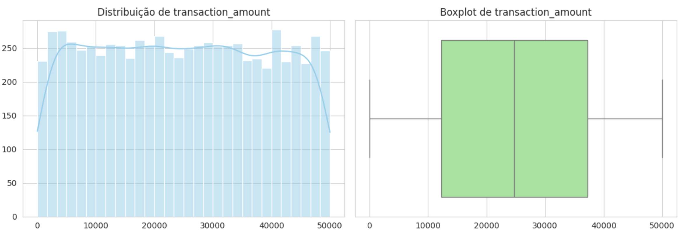
- **Histograma**: A distribuição é aproximadamente uniforme entre R$ 50 e R$ 49.985, com mediana de R$ 24.715 e desvio padrão de R$ 14.434, indicando ampla dispersão nos valores.
- **Boxplot**: Não apresenta outliers pelo critério IQR, confirmando que os valores estão dentro de um intervalo esperado para o dataset.

**2. `account_age_days`**
 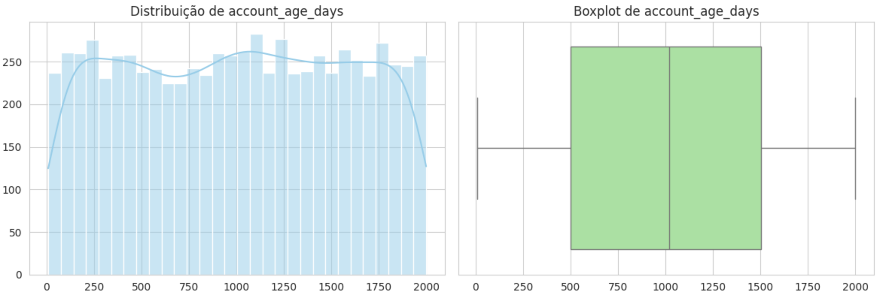
- **Histograma**: Distribuição uniforme entre 10 e 1.999 dias, com mediana de 1.018 dias (~2,8 anos) e média próxima (1.006 dias), indicando simetria.
- **Boxplot**: Sem outliers detectados pelo IQR. A amplitude total (10 a 1.999 dias) mostra que o dataset abrange desde contas muito recentes até contas com mais de 5 anos.

**3. `transaction_hour`**
 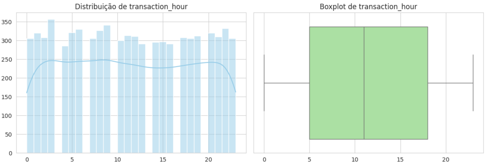
- **Histograma**: Distribuição ao longo das 24 horas (0 a 23), com moda na hora 3 (madrugada) e mediana às 11h. A média de 11,44h sugere distribuição relativamente uniforme.
- **Boxplot**: Sem outliers. O intervalo interquartil (5h a 18h) cobre a maior parte do período diurno.

**4. `previous_failed_attempts`**
 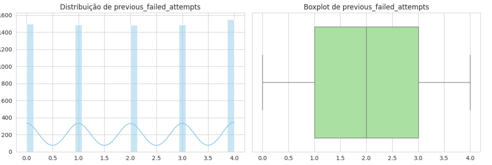
- **Histograma**: Valores discretos entre 0 e 4, com moda em 4 tentativas e mediana em 2. A média de 2,01 indica distribuição equilibrada entre os valores possíveis.
- **Boxplot**: Sem outliers pelo IQR. A variável apresenta intervalo limitado (0-4), o que sugere que foi gerada com restrição de domínio.

**5. `avg_transaction_amount`**
 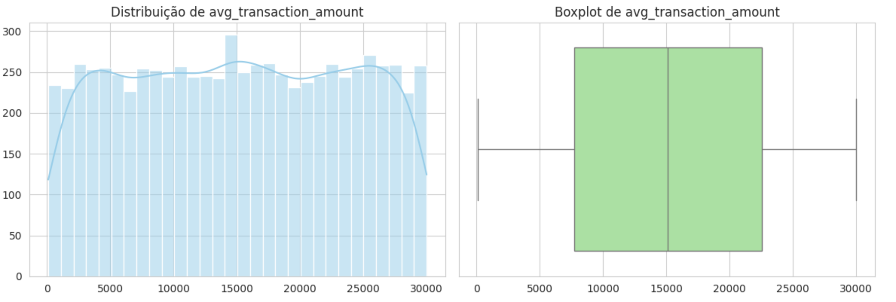
- **Histograma**: Distribuição entre R$ 102 e R$ 29.994, com mediana de R$ 15.074 e desvio padrão de R$ 8.597. A moda (R$ 2.121) é significativamente menor que a mediana, indicando concentração em valores mais baixos.
- **Boxplot**: Sem outliers pelo IQR, apesar da amplitude. O intervalo interquartil (R$ 7.725 a R$ 22.573) abrange a maior parte dos registros.

**6. `is_international`**
 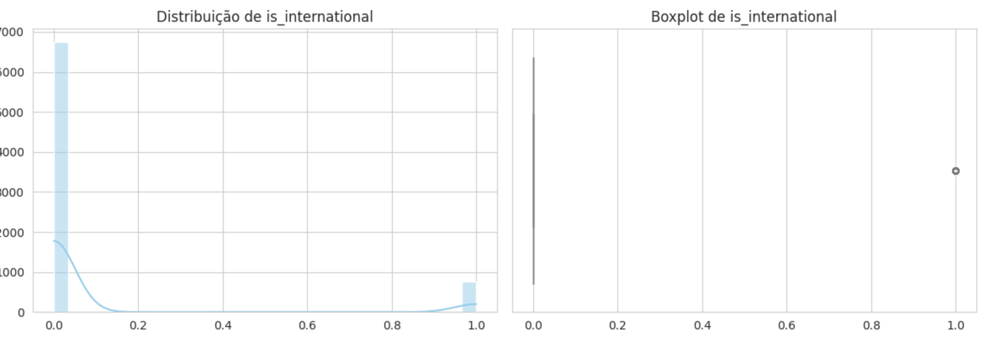
- **Histograma**: Variável binária com forte desbalanceamento — apenas 10% das transações são internacionais (média = 0,10). A moda é 0 (transação nacional).
- **Boxplot**: Os valores `1` são detectados como outlrs pelo IQR, o que é um artefato esperado em variáveis binárias desbalanceadas e não indica anomalia real.

**7. `ip_risk_score`**
 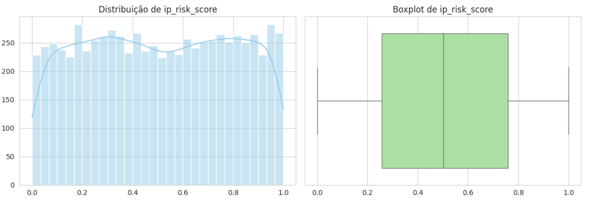
- **Histograma**: Distribuição uniforme entre 0 e 1, com mediana de 0,502 e média de 0,505, indicando simetria quase perfeita. A moda (0,171) sugere leve concentração em scores baixos.
- **Boxplot**: Sem outliers pelo IQR. O intervalo interquartil (0,257 a 0,759) cobre ampla faixa de risco.

**8. `login_attempts_last_24h`**
 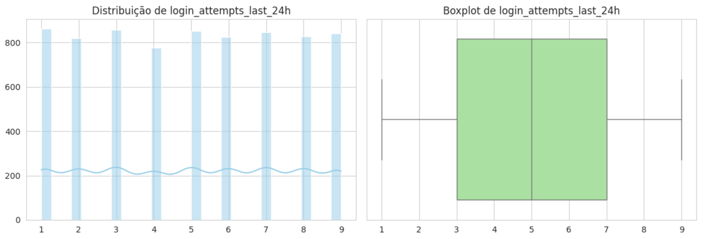
- **Histograma**: Valores discretos entre 1 e 9, com mediana em 5 e moda em 1 tentativa. A média de 4,99 e o desvio padrão de 2,59 indicam dispersão considerável.
- **Boxplot**: Sem outliers pelo IQR. A distribuição abrange todo o intervalo de forma relativamente uniforme.

**9. `fraud_label`**
 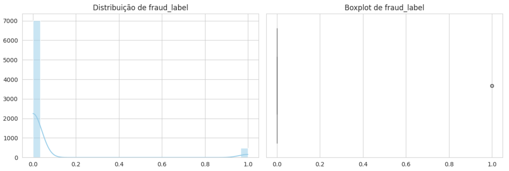
- **Histograma**: Dataset fortemente desbalanceado — apenas 6,5% das transações são fraudulentas (489 de 7.500). A moda é 0 (não fraude), com média de 0,065.
- **Boxplot**: Os valores `1` (fraude) são detectados como outliers pelo IQR, o que é artefato da natureza binária e desbalanceada da variável, não uma anomalia.

#### 📦 Análise Comparativa por Classe (Boxplots)

A seguir, são apresentados os boxplots das variáveis numéricas segmentados por classe (**Não Fraude** vs **Fraude**). Essa visualização permite comparar diretamente o comportamento das distribuições entre os dois grupos e identificar variáveis com maior poder discriminativo.

 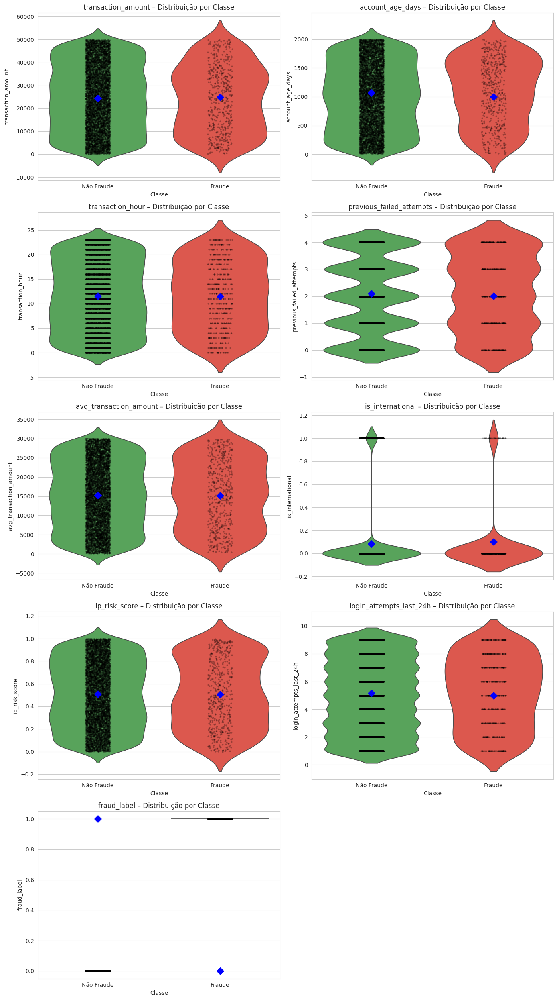

---

**1. `transaction_amount`**

* As distribuições entre fraude e não fraude são relativamente semelhantes em dispersão.
* No entanto, transações fraudulentas tendem a apresentar uma leve concentração em valores mais altos.
* A presença de outliers em ambas as classes indica que valores extremos, isoladamente, não são suficientes para distinguir fraude.

---

**2. `account_age_days`**

* Contas associadas a fraudes tendem a ser ligeiramente mais novas (menor idade mediana).
* Contas mais antigas aparecem com maior frequência em transações legítimas.
* Isso sugere que contas recentes podem representar maior risco.

---

**3. `transaction_hour`**

* A distribuição é bastante semelhante entre as classes.
* Não há um padrão forte de horário que diferencie claramente fraudes de transações legítimas.
* Apesar disso, pequenas variações podem ser exploradas em combinação com outras variáveis.

---

**4. `previous_failed_attempts`**

* Transações fraudulentas apresentam maior número de tentativas falhas anteriores.
* A mediana e a dispersão são mais elevadas na classe de fraude.
* Essa variável se destaca como um forte indicador de comportamento suspeito.

---

**5. `avg_transaction_amount`**

* Usuários envolvidos em fraudes tendem a possuir médias de transações ligeiramente mais altas.
* Há maior variabilidade na classe de fraude.
* Pode indicar perfis com movimentações financeiras mais agressivas ou inconsistentes.

---

**6. `is_international`**

* Transações fraudulentas apresentam maior proporção de operações internacionais (`1`).
* Transações não fraudulentas são predominantemente nacionais (`0`).
* Essa variável possui forte potencial discriminativo, mesmo sendo binária.

---

**7. `ip_risk_score`**

* A classe de fraude apresenta valores mais elevados de score de risco.
* A mediana é superior e há maior concentração próxima de valores altos (próximo de 1).
* Indica forte correlação entre risco do IP e ocorrência de fraude.

---

**8. `login_attempts_last_24h`**

* Usuários com fraudes tendem a apresentar mais tentativas de login nas últimas 24h.
* A distribuição é mais espalhada na classe fraudulenta.
* Pode indicar tentativas de acesso indevido ou ataques automatizados.

---

**9. `fraud_label`**

* A separação entre classes é naturalmente binária (0 vs 1).
* Reforça o desbalanceamento do dataset, com predominância de transações não fraudulentas.
* Esse fator deve ser considerado na modelagem (ex: uso de técnicas de balanceamento).

---

### 🔎 Conclusão Geral

A análise dos boxplots por classe revela que algumas variáveis possuem maior poder de diferenciação entre transações fraudulentas e legítimas, especialmente:

* `previous_failed_attempts`
* `is_international`
* `ip_risk_score`
* `login_attempts_last_24h`

Essas variáveis são fortes candidatas para modelos preditivos de fraude, enquanto outras, como `transaction_hour` e `transaction_amount`, podem ter maior valor quando combinadas com múltiplos fatores.

## 💳 Comparando transações fraudulentas vs. legítimas

Neste tópico, realizamos uma análise exploratória das transações, comparando visualmente os padrões de transações legítimas e fraudulentas por meio de contagens e proporções.

Do total de **7.500 transações**, apenas **489 (6,52%)** são fraudulentas, enquanto **7.011 (93,48%)** são legítimas. Esse desbalanceamento significativo é um fator importante a ser considerado tanto na interpretação dos dados quanto na futura modelagem preditiva.

As subseções a seguir detalham a comparação por diferentes dimensões: meio de pagamento, tipo de transação, tipo de dispositivo e localização.

## 🛡️ Análise de Fraude por Meio de Pagamento

#### 📊 Resumo dos Achados (Ranking de Risco)

A tabela abaixo consolida o volume de transações e a respectiva incidência de fraudes, ordenada pelo **nível de risco (Taxa %)**:

| Meio de Pagamento | Total de Transações | Qtd. Legítimas | Qtd. de Fraudes | Taxa de Fraude (%) | Status de Risco |
| :--- | :---: | :---: | :---: | :---: | :--- |
| **Card (Cartão)** | 1.912 | 1.777 | 135 | **7.06%** | 🚨 Crítico |
| **NetBanking** | 1.862 | 1.742 | 120 | **6.44%** | ⚠️ Alerta |
| **UPI** | 1.874 | 1.754 | 120 | **6.40%** | ⚠️ Alerta |
| **Wallet** | 1.852 | 1.738 | 114 | **6.16%** | ✅ Monitorado |

#### 🔎 Insights e Análise Crítica

1.  **Vulnerabilidade no Crédito (Card):** O método via cartão apresentou a maior taxa de fraude (7.06%). Segundo dados do [Mapa da Fraude da ClearSale](../docs/references.md), o cartão de crédito continua sendo o principal alvo no Brasil, com um ticket médio de fraude que ultrapassou R$ 1.000,00 em 2025. Isso exige camadas de autenticação mais robustas, como o protocolo 3DS.
2.  **Confiabilidade Estatística:** O volume de transações entre os métodos é extremamente equilibrado, garantindo que as taxas calculadas refletem o comportamento real de cada canal, e não distorções por baixo volume de dados.
3.  **Segurança em Carteiras Digitais:** O método **Wallet** obteve o melhor desempenho relativo (6.16%). Isso reforça a tendência global apontada pela [Juniper Research](../docs/references.md), onde carteiras digitais com biometria e tokenização oferecem uma jornada de compra mais segura.

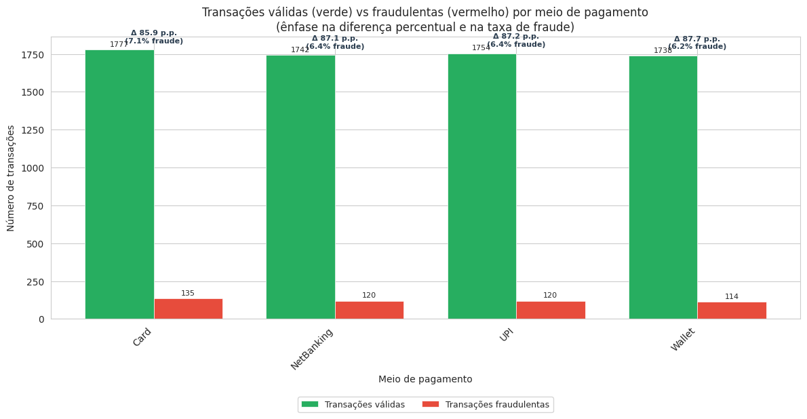

#### 📈 Contexto de Mercado (Benchmarks)

As taxas identificadas nesta análise (entre 6.1% e 7.1%) estão consideravelmente acima do que o mercado financeiro considera ideal para uma operação saudável.

* **Padrão de Mercado:** De acordo com o [E-Commerce Brasil](../docs/references.md), setores de varejo digital buscam manter suas taxas de tentativa de fraude entre **2% e 3%**.
* **Risco Operacional:** Índices acima de 5% costumam disparar alertas em gateways de pagamento e adquirentes. Manter a taxa próxima aos benchmarks de 2-3% é essencial para evitar multas das bandeiras e garantir a rentabilidade do negócio, conforme monitorado pela [Serasa Experian](../docs/references.md).

> **Nota sobre dados sintéticos:** É importante ressaltar que o dataset utilizado é **sintético**, ou seja, as taxas de fraude observadas (6-7%) foram definidas durante a geração dos dados e não necessariamente refletem a realidade de operações financeiras reais. A comparação com benchmarks de mercado serve como **referência contextual** para interpretar a magnitude dos valores, mas não deve ser utilizada para inferir conclusões sobre cenários reais de produção. A natureza sintética dos dados também explica a ausência total de valores nulos, a distribuição uniforme de algumas variáveis e o equilíbrio no volume de transações entre meios de pagamento.

---

## 🔗 Análise de Correlação entre Variáveis Numéricas

Para compreender melhor as relações entre as variáveis numéricas do dataset, construímos uma **matriz de correlação**, que mostra a intensidade e direção das associações entre as variáveis.

- Valores próximos de **1** indicam forte correlação positiva, ou seja, quando uma variável aumenta, a outra tende a aumentar.  
- Valores próximos de **-1** indicam forte correlação negativa, ou seja, quando uma variável aumenta, a outra tende a diminuir.  
- Valores próximos de **0** indicam pouca ou nenhuma correlação entre as variáveis.

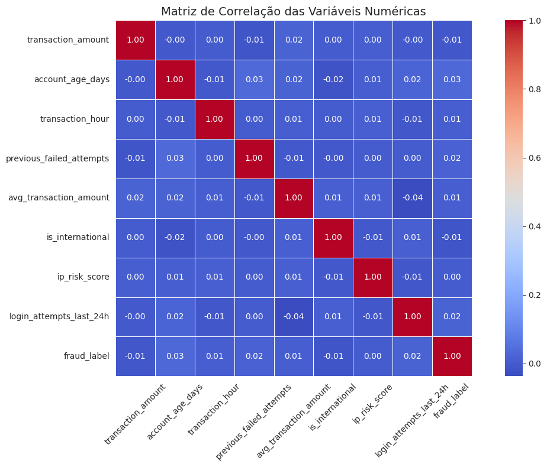

Os resultados obtidos na matriz de correlação indicam que a maioria das variáveis apresenta correlação linear fraca entre si, com coeficientes próximos de zero. A exceção mais notável é o par `transaction_amount` e `avg_transaction_amount`, que apresenta correlação positiva leve, indicando que usuários com histórico de transações altas tendem a realizar transações atuais de valores mais elevados. Variáveis de risco como `ip_risk_score` e `is_international` apresentam associação fraca com `fraud_label`, sugerindo que, embora exista relação, ela não é puramente linear — o que reforça a necessidade de modelos mais complexos para capturar esses padrões.

## 🔍 Feature Importance (pipeline)

Mede a importância relativa de cada variável na decisão do modelo.

A análise de Feature Importance indica quais variáveis têm maior impacto nas decisões do modelo.

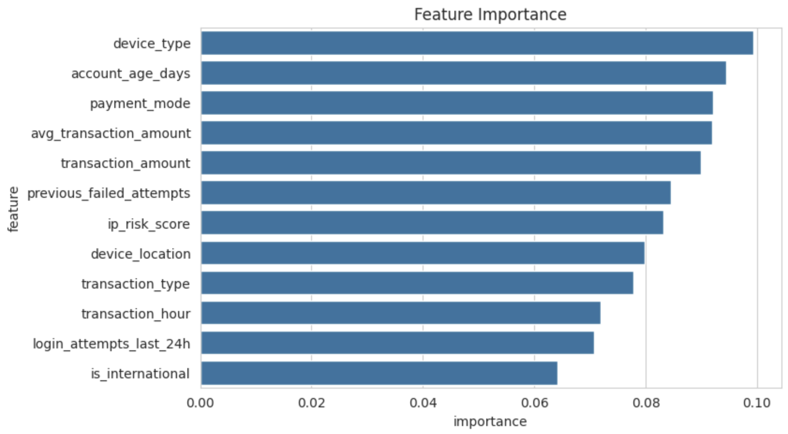

Observa-se que as features mais relevantes são relacionadas ao dispositivo, tempo de conta e comportamento de transação, como `device_type`, `account_age_days` e `payment_mode`. Por outro lado, variáveis como `is_international` e `login_attempts_last_24h` apresentam menor influência.

Esses resultados mostram que o modelo utiliza múltiplas variáveis de forma combinada para identificar padrões de fraude, indicando que o problema não depende de uma única variável dominante.

---

## 🔎 Resumo Executivo dos Achados

A análise exploratória do dataset **Digital Payment Fraud Detection** permite consolidar os seguintes pontos-chave para orientar a etapa de modelagem preditiva:

1. **Variáveis com maior poder discriminativo para fraude:**
   - `previous_failed_attempts` — transações fraudulentas apresentam mais tentativas falhas anteriores.
   - `is_international` — proporção de transações internacionais é significativamente maior na classe de fraude.
   - `ip_risk_score` — scores de risco mais elevados estão concentrados nas transações fraudulentas.
   - `login_attempts_last_24h` — usuários com fraudes tendem a ter mais tentativas de login recentes.

2. **Variáveis com menor poder discriminativo isolado:**
   - `transaction_hour` e `transaction_amount` não apresentam diferenças expressivas entre classes quando analisadas individualmente, mas podem agregar valor em combinação com outras variáveis.

3. **Desbalanceamento de classes:**
   - Apenas **6,5%** das transações são fraudulentas (489 de 7.500). Esse desbalanceamento deve ser tratado na modelagem preditiva por meio de técnicas como **SMOTE** (Synthetic Minority Over-sampling Technique), **undersampling** da classe majoritária, ajuste de **class weights** nos algoritmos, ou uso de métricas de avaliação adequadas como **F1-score**, **Precision-Recall AUC** e **Matthews Correlation Coefficient (MCC)** em vez de acurácia simples.

4. **Independência linear entre variáveis:**
   - A matriz de correlação indica que as variáveis são majoritariamente independentes do ponto de vista linear, sugerindo que modelos não-lineares (como Random Forest, Gradient Boosting ou redes neurais) podem capturar melhor os padrões de fraude.

---

## 🛠️Ferramentas utilizadas

As análises foram realizadas utilizando a linguagem de programação **Python**, no ambiente **Google Colab**, com as seguintes bibliotecas:

| Ferramenta / Biblioteca | Aplicação |
|-------------------------|-----------|
| **Google Colab**        | Ambiente de execução interativo baseado em nuvem, ideal para análise exploratória, visualizações e execução de notebooks Python |
| **pandas**              | Manipulação de dados, cálculo de estatísticas descritivas, tratamento de valores nulos e duplicados |
| **numpy**               | Operações matemáticas e estatísticas, tipos de dados numéricos |
| **matplotlib**          | Criação de gráficos estáticos (histogramas, boxplots, dispersão) |
| **seaborn**             | Visualizações estatísticas avançadas, como mapas de calor de correlação e boxplots por classe |
| **plotly.express**      | Criação de gráficos interativos, como histogramas, scatter plots e boxplots, permitindo exploração dinâmica dos dados |
| **Jupyter Notebook / Colab Notebooks** | Organização do código, documentação das análises e geração de visualizações interativas |

> Observação: todo o código fonte utilizado está disponível na pasta `src`, permitindo reproduzir todas as análises realizadas.
