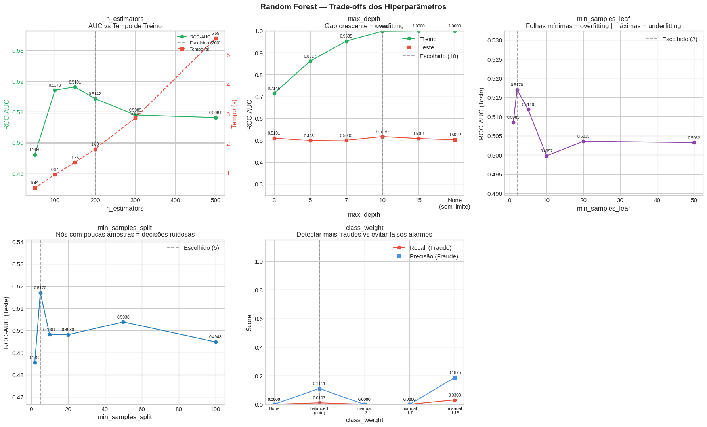
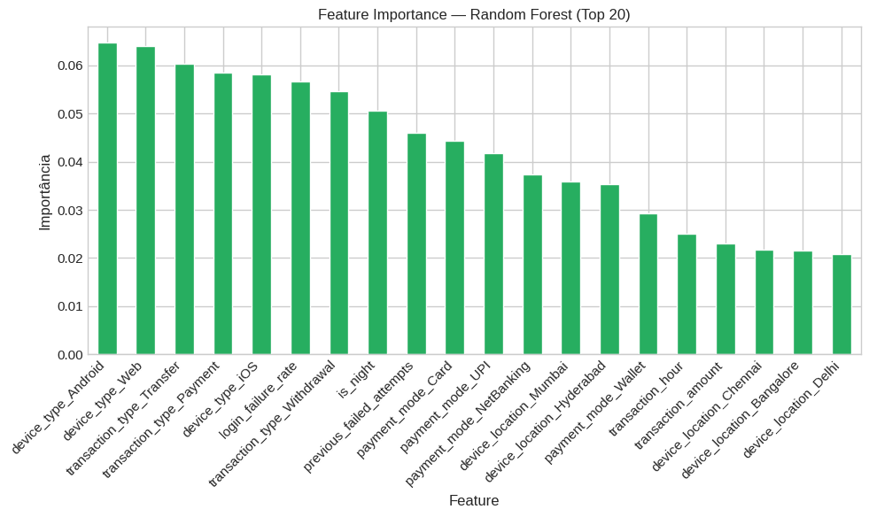
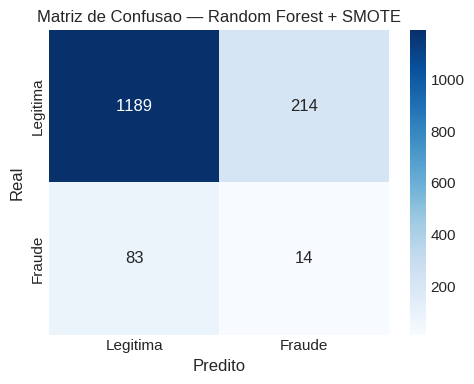

# ⚙️ Preparação dos Dados

**Limpeza de Dados**

O dataset original contém 7.500 transações e não apresentou valores ausentes nem registros duplicados, conforme verificado na etapa de qualidade dos dados [(seção 2.4)](../src/code/paymment_fraud_notebook.ipynb). A etapa de limpeza concentrou-se na remoção de colunas redundantes e identificadoras sem poder preditivo: `transaction_id` (único por linha, sem padrão generalizável), `user_id` (removido para evitar memorização por usuário), e colunas derivadas de agregações que introduziriam data leakage (`user_failed_mean`, `user_failed_min`, `failed_deviation`, `user_rolling_avg`, `user_rolling_std`). Após essa remoção, o dataset ficou com 21 colunas. Em seguida, colunas com valores ausentes foram eliminadas via `dropna(axis=1)`.

A detecção de outliers foi conduzida via IQR (padrão e exploratório). Optou-se pela manutenção dos outliers no dataset de modelagem, pois em detecção de fraude valores extremos são frequentemente os casos de maior interesse - removê-los comprometeria a capacidade do modelo de identificar exatamente os padrões anômalos que definem fraude.

**Transformação de Dados**

Variáveis categóricas (`payment_mode`, `device_type`, `device_location`, `transaction_type`) foram convertidas para formato numérico via *one-hot encoding* (`pd.get_dummies`), gerando colunas binárias para cada categoria. Normalização e padronização não foram aplicadas: modelos baseados em árvores de decisão são invariantes à escala das features, e aplicar `StandardScaler` antes do split treino/teste introduziria data leakage - o scaler aprenderia a média e o desvio padrão do conjunto de teste.

**Engenharia de Features**

Foram criadas oito categorias de features derivadas para capturar padrões comportamentais que as variáveis brutas não expressam isoladamente:

| Feature | Descrição |
|---|---|
| `amount_vs_user_avg` | Desvio do valor da transação em relação à média histórica do usuário |
| `risk_login` | Produto entre tentativas de login nas últimas 24h e histórico de falhas |
| `login_failure_rate` | Taxa de falhas = `previous_failed_attempts / (login_attempts + 1)` |
| `is_night` | Binária: 1 se a transação ocorreu entre 00h–05h |
| `international_risk` | Produto entre `is_international` e `ip_risk_score` |
| `risk_interaction` | Binária: 1 se a transação é noturna E internacional simultaneamente |
| `is_anomalous_amount` | Binária: 1 se o valor supera a média histórica do usuário por mais de 2 desvios padrão |
| `amount_zscore_safe` | Z-score do valor da transação relativo ao histórico acumulado do usuário |

Todas as features baseadas em histórico do usuário foram calculadas com `expanding()` sobre os dados ordenados por `(user_id, transaction_hour)`, garantindo que cada cálculo utilize apenas dados anteriores àquela transação e evitando vazamento de informação futura.

**Detecção de Vazamento de Dados**

Antes da modelagem, foi realizada verificação sistemática de data leakage: análise de correlação entre features e a variável alvo (todas abaixo de 0.08 em valor absoluto, sem indício de leakage), comparação de médias por classe (diferenças pequenas, sem features derivadas diretamente do rótulo) e análise de padrões por usuário (mediana de 1 transação por usuário, baixo risco de memorização). Colunas derivadas da variável alvo geradas durante a EDA (`fraud_label_name`, `status_fraude`) foram explicitamente removidas antes do treinamento.

**Tratamento de Desbalanceamento**

O dataset apresenta desbalanceamento de classes: 7.011 transações legítimas (93,5%) contra 489 fraudes (6,5%), razão aproximada de 14:1. O tratamento foi feito via SMOTE (*Synthetic Minority Over-sampling Technique*) aplicado dentro de cada fold da validação cruzada através de `ImbPipeline`, garantindo que amostras sintéticas não contaminem os folds de validação - prática que inflaria artificialmente o AUC se o SMOTE fosse aplicado antes do split.

**Separação dos Dados**

Os dados foram divididos em 80% treino (6.000 amostras) e 20% teste (1.500 amostras) por posição após ordenação por `(user_id, transaction_hour)`. A validação cruzada com 5 folds foi aplicada sobre o conjunto completo para estimativa de AUC médio.

---

## 📑 Descrição do Modelo

O algoritmo selecionado foi o **Random Forest**, um método de *ensemble* baseado em *bagging*. Múltiplas árvores de decisão são treinadas de forma independente, cada uma sobre uma amostra aleatória com reposição dos dados de treino (*bootstrap*) e com um subconjunto aleatório das features em cada divisão. A predição final é obtida por votação majoritária entre as árvores. Essa independência entre os estimadores confere ao modelo resistência natural ao overfitting e robustez a ruído, além de produzir estimativas de importância de features como subproduto do treinamento.

O Random Forest foi escolhido por três razões centrais: (1) invariância à escala das features, eliminando a necessidade de normalização e o risco de leakage associado; (2) capacidade de capturar interações não-lineares entre variáveis sem especificação manual; (3) paralelização nativa (`n_jobs=-1`), reduzindo o tempo de treinamento sem impacto na qualidade do modelo.

**Ajuste de Hiperparâmetros**

Os parâmetros foram experimentados sistematicamente e os efeitos documentados nos gráficos de trade-off:

| Hiperparâmetro | Valor Escolhido | Justificativa |
|---|---|---|
| `n_estimators` | 200 | AUC estabiliza após ~150; 200 garante convergência sem custo computacional desnecessário |
| `max_depth` | 10 | Ponto anterior ao gap treino/teste; profundidades maiores geram overfitting |
| `min_samples_split` | 5 | Pico de AUC no teste; valores menores criam divisões ruidosas |
| `min_samples_leaf` | 2 | Filtro de estabilidade; impede regras baseadas em exemplos únicos |
| `class_weight` | `'balanced'` | Ajuste automático ≈ 14× para fraude; equilibra recall sem colapsar precisão |
| `n_jobs` | -1 | Paralelização total de todos os núcleos de CPU disponíveis; sem impacto na qualidade |

*Gráficos de trade-off: efeito de `n_estimators`, `max_depth`, `min_samples_leaf`, `min_samples_split` e `class_weight` sobre AUC, overfitting e tempo de treino. Cada ponto está anotado com seu valor.*

*Ranking das 20 features mais importantes pelo ganho médio nas árvores de decisão.*

---

## 📊 Avaliação dos Modelos Criados

### Métricas Utilizadas

Foram utilizadas quatro métricas de avaliação, escolhidas pelo contexto de desbalanceamento severo e pelo custo assimétrico dos erros em detecção de fraude:

**ROC-AUC (Área sob a Curva ROC)**
Mede a capacidade do modelo de ordenar corretamente exemplos positivos (fraude) acima dos negativos (legítimo), independentemente do threshold de classificação. É a métrica principal neste problema porque é insensível ao desbalanceamento de classes - ao contrário da acurácia, que seria trivialmente alta (93,5%) ao classificar tudo como legítimo.

**Recall (Sensibilidade)**
Proporção de fraudes reais que o modelo consegue detectar. No contexto de detecção de fraude, um falso negativo (fraude não detectada) tem custo operacional e reputacional elevado. Maximizar o recall é prioritário, mesmo que implique aceitar mais falsos positivos.

**Precisão**
Proporção de alertas de fraude que correspondem a fraudes reais. Precisão baixa significa alto volume de falsos positivos - transações legítimas bloqueadas - o que gera atrito com o cliente e custo operacional de investigação. O equilíbrio entre recall e precisão é gerenciado pelo `class_weight` e pelo threshold de classificação.

**F1-Score**
Média harmônica entre precisão e recall. Sintetiza o trade-off entre as duas métricas em um único valor, sendo especialmente útil para comparar modelos em contextos desbalanceados onde nem o recall isolado nem a precisão isolada contam a história completa.

### Discussão dos Resultados Obtidos

| Modelo | ROC-AUC (CV-5) | ROC-AUC (Teste) | Recall - Fraude | Precisão - Fraude | F1 - Fraude | Acurácia |
|---|---|---|---|---|---|---|
| Random Forest + SMOTE | 0.497 ± 0.034 | 0.498 | 0.14 | 0.06 | 0.09 | 0.80 |

*Matriz de confusão e curva ROC do modelo Random Forest + SMOTE no conjunto de teste.*

O modelo apresentou ROC-AUC de 0.498 no conjunto de teste - valor equivalente ao de um classificador aleatório (0.50). O recall de 0.14 indica que apenas 14% das fraudes foram detectadas, e a precisão de 0.06 revela que 94% dos alertas gerados eram falsos positivos. A acurácia global de 80%, embora aparentemente alta, é enganosa: decorre da estratégia trivial de classificar a maioria dos exemplos como legítimos, dado que fraudes representam apenas 6,5% do dataset.

**Por que o desempenho é próximo do aleatório?**

A causa provável está na combinação entre a ordenação dos dados e a estratégia de divisão treino/teste. O dataset foi ordenado por `(user_id, transaction_hour)` para viabilizar o cálculo de estatísticas expansivas por usuário. A divisão subsequente - primeiros 80% para treino, últimos 20% para teste - faz com que o conjunto de teste contenha exclusivamente usuários com identificadores elevados, enquanto o treino contém apenas os de identificadores menores. Esse fenômeno, chamado de **distribution shift**, invalida a avaliação: o modelo é testado em uma população diferente daquela em que foi treinado.

A validação cruzada com 5 folds confirma que o problema é estrutural: o AUC médio de 0.497 com desvio de 0.034 indica que, independentemente de qual partição é usada como teste, o modelo não consegue discriminar as classes.

Em relação aos objetivos do projeto - identificar transações fraudulentas com alto recall e AUC - os resultados não foram alcançados no modelo final. Contudo, a análise metodológica (engenharia de features, aplicação correta do SMOTE dentro do pipeline de CV, análise de trade-offs de hiperparâmetros e detecção de data leakage) demonstrou a aplicação adequada das técnicas, e o diagnóstico do distribution shift constitui por si um resultado analítico relevante.

---

## 🧪 Pipeline de Pesquisa e Análise de Dados

O pipeline seguido neste projeto organiza-se nas seguintes etapas sequenciais:

**1. Coleta e Carregamento dos Dados**
Download automatizado via `kagglehub` do dataset *Digital Payment Fraud Detection* (Kaggle). Leitura em DataFrame com `pandas`.

**2. Análise Exploratória de Dados (EDA)**
Inspeção de estrutura (shape, tipos, cardinalidade), qualidade (ausentes, duplicatas), estatísticas descritivas (média, mediana, desvio padrão, percentis 1/5/95/99), detecção visual de outliers via boxplots e histogramas, análise de correlação por Pearson e Spearman, e análise direcionada ao comportamento da variável alvo `fraud_label` por segmento (dispositivo, modalidade de pagamento, localização geográfica).

**3. Detecção Estatística de Outliers**
Aplicação de IQR padrão (fator 1.5) e IQR exploratório (fator 0.5) para quantificar a concentração de outliers por coluna, visualizada em heatmap. Decisão de manutenção dos outliers pela relevância em detecção de anomalia.

**4. Análise de Correlação Bivariada**
Matrizes de correlação (Pearson e Spearman) e gráficos de dispersão para pares de variáveis com maior poder discriminativo potencial.

**5. Análise de Fraude**
Distribuição da variável alvo, taxa de fraude por segmento (tipo de dispositivo, modalidade de pagamento, localização) e análise de densidade do valor das transações por classe.

**6. Engenharia de Features**
Criação de features comportamentais, de risco composto, temporais, geográficas e de anomalia por histórico rolling, com uso de `expanding()` para garantir ausência de leakage temporal.

**7. Detecção de Vazamento de Dados**
Verificação sistemática via correlação com o alvo, comparação de médias por classe e análise de padrões por usuário. Remoção de colunas identificadoras e derivadas do rótulo.

**8. Preparação Final para Modelagem**
Remoção de colunas redundantes, eliminação de colunas com ausentes, codificação de variáveis categóricas via one-hot encoding, divisão treino/teste 80/20 e validação cruzada estratificada com 5 folds.

**9. Treinamento e Avaliação do Modelo**
Treinamento do pipeline `ImbPipeline(SMOTE → RandomForestClassifier)`, validação cruzada para estimativa de AUC médio, avaliação no conjunto de teste com relatório de classificação, ROC-AUC, matriz de confusão e importância de features.

*Matriz de confusão e curva ROC — resultado final do modelo no conjunto de teste.*

*Top 20 features por importância no Random Forest.*

**10. Análise de Trade-offs dos Hiperparâmetros**
Experimentos sistemáticos variando `n_estimators`, `max_depth`, `min_samples_leaf`, `min_samples_split` e `class_weight`, com gráficos anotados ponto a ponto para documentar o efeito de cada parâmetro sobre overfitting, qualidade preditiva e custo computacional.

*Cinco experimentos de trade-off documentando o efeito de cada hiperparâmetro escolhido.*

**11. Conclusão e Diagnóstico**
Consolidação dos resultados, diagnóstico do distribution shift como causa do AUC próximo ao aleatório, e proposição de melhorias metodológicas (divisão estratificada aleatória, `StratifiedKFold`, análise de feature leakage nas features de histórico).
