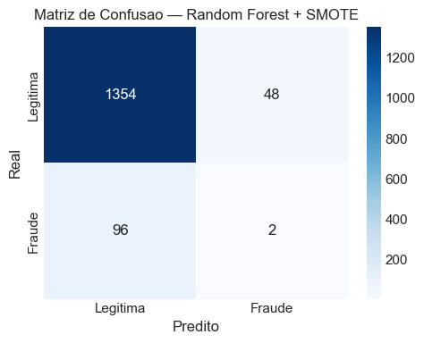
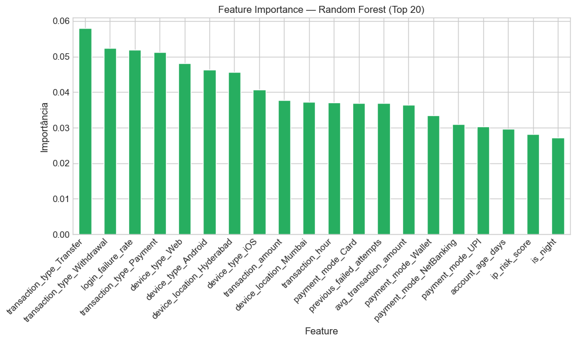
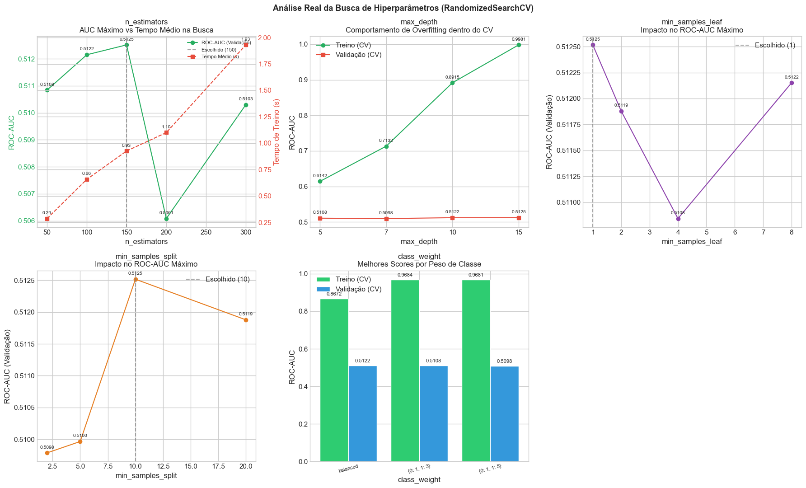
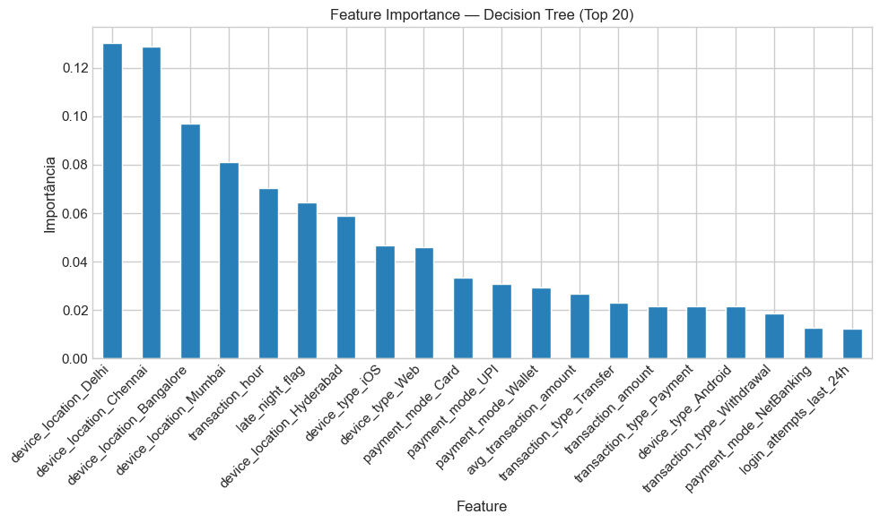
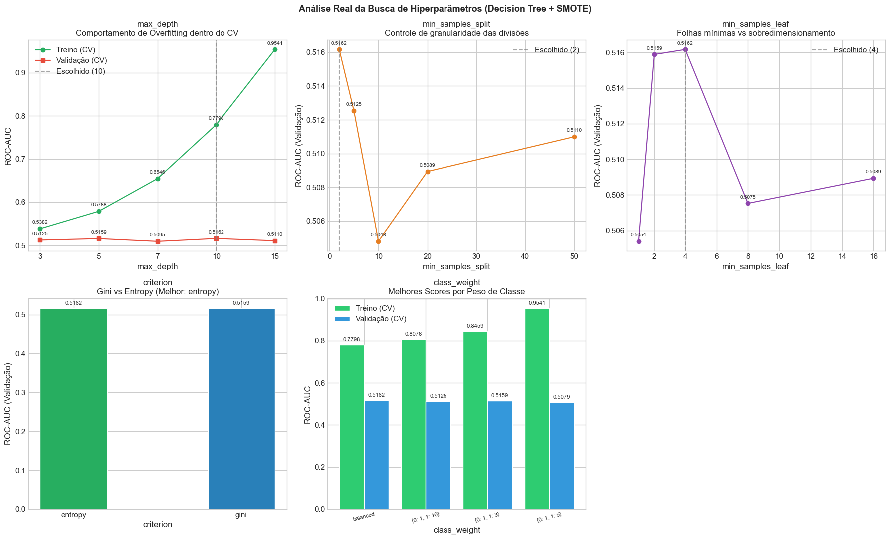
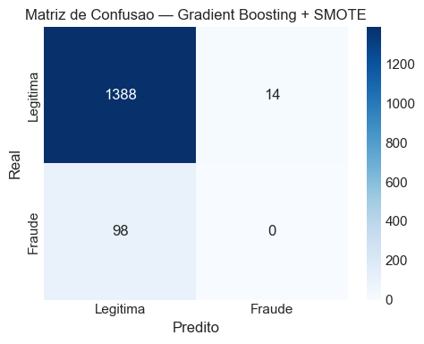
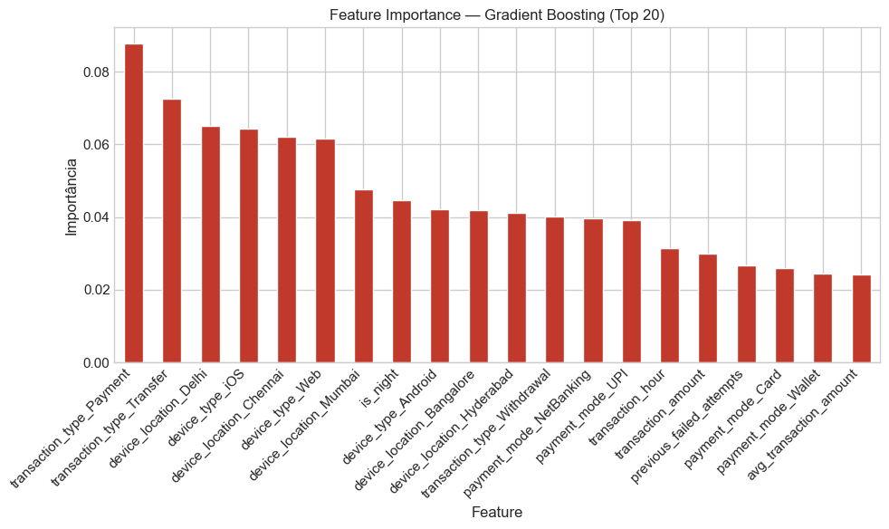
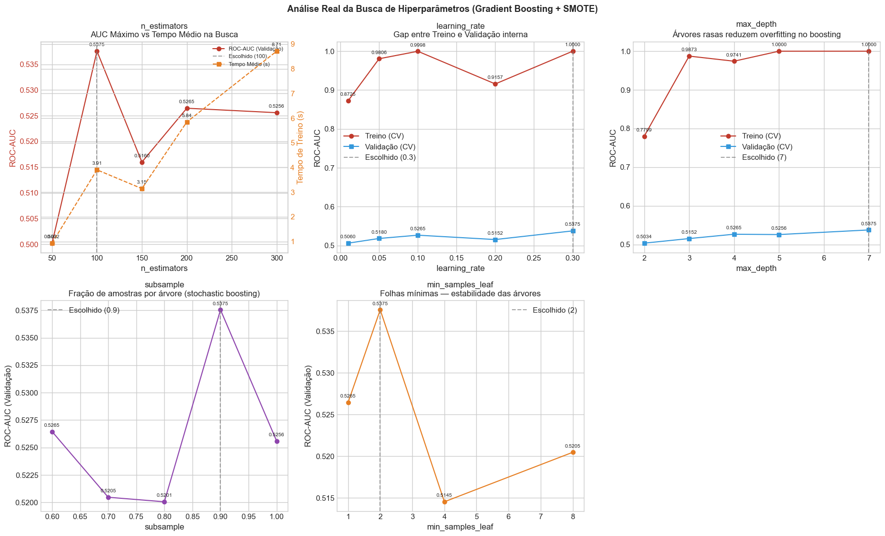

# Preparação dos dados

O conjunto de dados original contém **7.500 transações e 15 atributos** (incluindo a variável alvo `fraud_label`), não apresentando valores ausentes nem registros duplicados, conforme verificado na etapa de qualidade dos dados [(Google Colab - seção 2.4)](../src/code/paymment_fraud_notebook.ipynb).

A preparação dos dados seguiu uma sequência estruturada para garantir a reprodutibilidade dos modelos e evitar o vazamento de dados (*data leakage*):

1. **Dataset Original:** Carga da base contendo 15 variáveis.
2. **Engenharia de Features:** Criação de 13 novos atributos comportamentais e temporais no dataset.
3. **Limpeza e Remoção de Leakage:** Eliminação de variáveis identificadoras e de atributos com potencial de vazamento de dados.
4. **Codificação Categórica:** Conversão das colunas categóricas para dummies via `pd.get_dummies`.

Ao final desse fluxo, o conjunto de dados resultante continha **25 colunas antes da codificação** (24 features + 1 target) e **38 colunas após a codificação** (37 features + 1 target). Esta mesma base final foi utilizada de forma consistente e idêntica para o treinamento e teste dos três modelos comparados (Random Forest, Árvore de Decisão e Gradient Boosting).

As etapas detalhadas de engenharia de atributos, limpeza e transformação dos dados são apresentadas a seguir.

## Engenharia de Features

Foram criadas 13 variáveis adicionais com o objetivo de capturar padrões comportamentais associados a transações potencialmente fraudulentas:

| Feature | Descrição |
|---|---|
| `period_of_day` | Categoria do período do dia (madrugada, manha, tarde, noite) com base na hora |
| `late_night_flag` | Flag indicando transação na madrugada (0h às 5h) |
| `hour_sin` | Codificação cíclica do horário da transação (seno) |
| `hour_cos` | Codificação cíclica do horário da transação (cosseno) |
| `international_night` | Interação indicando transações internacionais ocorridas na madrugada |
| `high_amount_flag` | Flag indicando transação com valor acima do quantil 95% do dataset global (temporário) |
| `high_ip_risk` | Flag indicando IP de alto risco (score > 0.8) |
| `many_login_attempts` | Flag indicando mais de 5 tentativas de login nas últimas 24 horas |
| `risk_login` | Produto entre tentativas de login e tentativas falhas anteriores |
| `login_failure_rate` | Proporção de falhas de login em relação ao total de tentativas |
| `is_night` | Flag indicando horário noturno (0h às 6h) |
| `international_risk` | Produto entre o indicador de transação internacional e o score de risco do IP |
| `night_intl_risk` | Interação indicando madrugada (0h-6h) + transação internacional |

## Limpeza de Dados e Remoção de Leakage

Para garantir a generalização do modelo e a integridade da validação cruzada, foram identificadas e removidas variáveis com potencial de **data leakage** (vazamento de dados) ou sem poder preditivo:

* **Identificadores Únicos:**
  * `transaction_id`: Identificador único da transação, sem poder generalizável.
  * `user_id`: Identificador do usuário. Causaria overfitting por identidade do cliente.
* **Leakage por Quantil Global:**
  * `high_amount_flag`: Removida do conjunto direto porque o quantil de 95% foi calculado sobre todo o dataset (incluindo dados futuros/de teste).
* **Outras Variáveis Redundantes / Removidas preventivamente:**
  * Variáveis que envolviam estatísticas globais dos usuários ou codificações com target encoding calculado sobre todo o dataset (`user_failed_mean`, `user_failed_min`, `failed_deviation`, `user_rolling_avg`, `user_rolling_std`, `hour_risk_encoded`, `user_transaction_count`) foram explicitamente excluídas do pipeline para mitigar qualquer possibilidade de leakage.

Após essas remoções, o conjunto de modelagem permaneceu com **25 colunas** (24 features + `fraud_label`).

## Transformação de Dados

As variáveis categóricas (`transaction_type`, `payment_mode`, `device_type`, `device_location`) foram codificadas para formato numérico, permitindo o uso pelos algoritmos baseados em árvores. Modelos de árvore, como Random Forest, Árvore de Decisão e Gradient Boosting, são **invariantes à escala**, eliminando a necessidade de normalização ou padronização das features numéricas contínuas. Essa propriedade reduz o risco de data leakage que ocorreria se o scaler fosse ajustado sobre o dataset inteiro.

## Tratamento de Dados Desbalanceados

O dataset apresenta forte desbalanceamento: apenas **6,5%** das transações são fraudulentas (489 de 7.500). Para equilibrar as classes durante o treino, foi aplicado o **SMOTE** (Synthetic Minority Over-sampling Technique).

O SMOTE cria amostras sintéticas da classe minoritária interpolando vizinhos existentes. Para evitar **contaminação do conjunto de validação**, o SMOTE foi aplicado exclusivamente dentro de cada fold da validação cruzada, via `ImbPipeline` da biblioteca `imbalanced-learn`. Essa prática garante que amostras sintéticas do treino não vazem para o fold de validação, o que inflaria artificialmente o AUC.

## Separação de Dados

Os dados foram divididos em conjuntos de treino e teste com proporção **80/20**, utilizando `train_test_split` do scikit-learn com os seguintes parâmetros:

- `test_size=0.2` — 20% para teste
- `random_state=42` — reprodutibilidade
- `stratify=y` — mantém a proporção de classes em ambos os conjuntos
- `shuffle=True` — embaralha os dados antes da divisão (padrão do sklearn)

A estratificação é essencial em datasets desbalanceados, garantindo que tanto o treino quanto o teste preservem a taxa de fraude de ~6,5%.

## Validação Cruzada

A busca de hiperparâmetros utilizou **validação cruzada estratificada com 5 folds** (CV-5), com **ROC-AUC** como métrica de otimização. O CV-5 divide o treino em 5 partes, treinando em 4 e validando em 1, repetindo 5 vezes. Isso torna a avaliação mais robusta e menos dependente de uma única partição dos dados.

---

# Descrição dos Modelos

## Random Forest com SMOTE

O **Random Forest** é um algoritmo de *ensemble* baseado em *bagging*. Múltiplas árvores de decisão são treinadas de forma independente, cada uma sobre uma amostra aleatória dos dados (bootstrap), e as predições finais são obtidas por votação majoritária. Essa independência confere ao modelo resistência natural ao overfitting, pois erros individuais de cada árvore tendem a se cancelar na agregação.

### Hiperparâmetros explorados

| Parâmetro | Valores testados | Descrição |
|---|---|---|
| `n_estimators` | 50, 100, 150, 200, 300 | Número de árvores no ensemble |
| `max_depth` | 5, 7, 10, 15 | Profundidade máxima de cada árvore |
| `min_samples_split` | 2, 5, 10, 20 | Mínimo de amostras para dividir um nó |
| `min_samples_leaf` | 1, 2, 4, 8 | Mínimo de amostras em uma folha |
| `class_weight` | balanced, None, {0:1,1:3}, {0:1,1:5} | Peso das classes para lidar com desbalanceamento |

A busca foi realizada via `RandomizedSearchCV` com 25 iterações, CV-5 estratificado e ROC-AUC como critério.

### Matriz de Confusão

A matriz de confusão do Random Forest sobre o conjunto de teste revela o padrão típico de um modelo que não consegue discriminar as classes: a grande maioria das transações legítimas é corretamente classificada (verdadeiros negativos), mas a maioria das fraudes passa despercebida (falsos negativos). O baixo recall (~9%) indica que menos de 1 em 10 fraudes é corretamente identificada.

### Importância das Features

O ranking de importância revelou quais variáveis o algoritmo considerou mais informativas para particionar os dados. Mesmo com AUC próximo de 0.50, o ranking reflete a estrutura de correlação existente no treino e serve como ponto de partida para seleção de features em cenários futuros.

### Análise de Trade-offs

Os cinco gráficos abaixo mostram como cada hiperparâmetro afeta overfitting, qualidade e velocidade de treino do Random Forest:

1. **`n_estimators` (Número de árvores):** o gráfico mostra o comportamento assintótico da ROC-AUC em relação ao número de árvores. Acurácia de treino continua crescendo com mais árvores, mas a acurácia de validação estabiliza, indicando que adicionar árvores além de certo ponto não melhora a generalização.

2. **`max_depth` (Profundidade máxima):** a curva de gap treino/teste mostra como profundidades maiores aumentam a capacidade de memorização do treino sem necessariamente melhorar o desempenho no teste, confirmando a necessidade de regularização.

3. **`min_samples_split` e `min_samples_leaf`:** esses parâmetros controlam a granularidade das divisões. Valores maiores impedem que o modelo crie regras excessivamente específicas para poucas amostras, atuando como regularizadores.

4. **`class_weight`:** o trade-off entre recall e precisão é visível quando diferentes pesos de classe são aplicados. Configurações que favorecem a classe minoritária aumentam o recall (detectam mais fraudes) mas diminuem a precisão (mais falsos alarmes).

---

## Árvore de Decisão com SMOTE

A **Árvore de Decisão** é um modelo de aprendizado supervisionado que particiona o espaço de features recursivamente, criando regras de divisão binárias. Ao contrário do Random Forest, uma única árvore é treinada sem bagging — o que a torna mais interpretável, porém mais suscetível a overfitting quando não há limitação de profundidade.

### Hiperparâmetros explorados

| Parâmetro | Valores testados | Descrição |
|---|---|---|
| `max_depth` | 3, 5, 7, 10, 15 | Profundidade máxima da árvore |
| `min_samples_split` | 2, 5, 10, 20, 50 | Mínimo de amostras para dividir um nó |
| `min_samples_leaf` | 1, 2, 4, 8, 16 | Mínimo de amostras em uma folha |
| `criterion` | gini, entropy | Critério de pureza para divisão |
| `class_weight` | balanced, {0:1,1:3}, {0:1,1:5}, {0:1,1:10} | Peso das classes |

### Matriz de Confusão

A matriz de confusão da Árvore de Decisão apresentou padrão qualitativamente idêntico ao do Random Forest. A grande maioria das transações legítimas foi corretamente classificada, enquanto a maioria das fraudes foi erroneamente rotulada como legítimas. A similaridade visual entre as matrizes de RF e DT reforça que o problema não é de variância (overfitting), mas de ausência de sinal discriminativo nas features disponíveis.

### Importância das Features

O ranking de importância da Árvore de Decisão mostra quais features geraram maior ganho de impureza nas divisões. Como modelo de única árvore, a importância é calculada a partir do ganho acumulado em cada split, sendo mais diretamente interpretável que o RF (onde a importância é uma média sobre centenas de árvores).

### Análise de Trade-offs

Os cinco gráficos abaixo mostram como cada hiperparâmetro afeta overfitting, qualidade e velocidade de treino da Árvore de Decisão:

1. **`max_depth`:** o gráfico de treino vs. validação mostra como profundidades maiores permitem que a árvore memorize padrões do treino sem melhorar a generalização. O ponto ótimo é aquele onde a validação estabiliza antes do overfitting.

2. **`min_samples_split`:** controla o mínimo de amostras necessário para dividir um nó. Valores maiores impedem que a árvore crie divisões baseadas em poucas amostras, reduzindo o risco de overfitting.

3. **`min_samples_leaf`:** define o mínimo de amostras em uma folha terminal. Similar ao `min_samples_split`, mas agindo no nível da folha, garantindo que cada decisão final tenha suporte amostral suficiente.

4. **`criterion` (Gini vs. Entropy):** compara os dois critérios de pureza. Embora matematicamente diferentes, ambos tendem a produzir árvores similares na prática.

5. **`class_weight`:** mostra o efeito de diferentes pesos de classe no trade-off entre recall e precisão, permitindo ajustar a sensibilidade do modelo à classe minoritária.

### Vantagens e limitações

A principal vantagem da DT é a **interpretabilidade**. Cada caminho da raiz até uma folha representa uma regra lógica explícita do tipo "SE `transaction_amount` > X E `transaction_hour` > Y ENTÃO fraude". Em um cenário com AUC adequado, essas regras poderiam ser auditadas por especialistas de negócio e traduzidas diretamente em políticas operacionais.

A DT também treina e prediz ordens de magnitude mais rápido que o RF e o GB, sendo ideal para sistemas de detecção em tempo real. No entanto, sem mecanismo de agregação, é mais suscetível a overfitting e apresenta menor capacidade de capturar interações complexas.

---

## Gradient Boosting com SMOTE

O **Gradient Boosting** é um algoritmo de *ensemble* baseado em *boosting* sequencial: cada árvore corrige os erros da árvore anterior, minimizando um gradiente da função de perda. Ao contrário do Random Forest (paralelo), o boosting é inerentemente sequencial — o que confere maior precisão em datasets tabulares, mas exige atenção redobrada ao overfitting e ao custo computacional.

### Hiperparâmetros explorados

| Parâmetro | Valores testados | Descrição |
|---|---|---|
| `n_estimators` | 50, 100, 150, 200, 300 | Número de árvores sequenciais |
| `learning_rate` | 0.01, 0.05, 0.1, 0.2, 0.3 | Taxa de aprendizado (tamanho do passo) |
| `max_depth` | 2, 3, 4, 5, 7 | Profundidade máxima de cada árvore |
| `subsample` | 0.6, 0.7, 0.8, 0.9, 1.0 | Fração de amostras por árvore |
| `min_samples_leaf` | 1, 2, 4, 8 | Mínimo de amostras em uma folha |

### Matriz de Confusão

A matriz de confusão do Gradient Boosting confirmou o mesmo padrão observado nos outros dois modelos: alta acurácia na classe majoritária (transações legítimas) e baixíssima detecção da classe minoritária (fraudes). A consistência entre as três matrizes — mesmo com algoritmos de arquiteturas distintas — é evidência estatística forte de que a limitação é estrutural no dataset, não algorítmica.

### Importância das Features

O ranking de importância do Gradient Boosting reflete a redução acumulada de impureza em todas as árvores do ensemble sequencial. Diferente do RF, onde cada árvore é independente, no GB a importância é influenciada pela ordem das árvores: features que corrigem erros persistentes nas primeiras iterações tendem a ter importância mais alta.

### Análise de Trade-offs

Os cinco gráficos abaixo mostram como cada hiperparâmetro afeta overfitting, qualidade e estabilidade do Gradient Boosting:

1. **`n_estimators` vs. Tempo de Treino:** o gráfico mostra o trade-off entre número de árvores e tempo de treino. No GB, árvores adicionais melhoram o modelo até um ponto de inflexão, após o qual o overfitting começa a prejudicar a generalização.

2. **`learning_rate`:** a taxa de aprendizado controla o "tamanho do passo" de cada árvore. Valores menores exigem mais árvores para convergir, mas resultam em modelos mais estáveis. Valores maiores aceleram o treino, mas aumentam o risco de divergência.

3. **`max_depth`:** árvores mais rasas no GB funcionam como "weak learners", corrigindo erros de forma gradual. Profundidades maiores aumentam a capacidade de cada árvore individual, mas também o risco de overfitting.

4. **`subsample`:** a fração de amostras usada em cada árvore introduz aleatoriedade que ajuda a prevenir overfitting. Valores menores que 1.0 criam um efeito similar ao bagging do RF, mas aplicado sequencialmente.

5. **`min_samples_leaf`:** folhas com mais amostras resultam em predições mais estáveis e menos sensíveis a outliers, suavizando as fronteiras de decisão do modelo.

### Vantagens e limitações

O GB frequentemente supera outros ensembles em competições de machine learning tabular devido à sua capacidade de modelar interações complexas e não-lineares. No entanto, seu treino sequencial é inerentemente lento e não paralelizável. Hiperparâmetros como `subsample` e `min_samples_leaf` oferecem ferramentas de regularização sofisticadas, mas o modelo é mais sensível a outliers e pode divergir com `learning_rate` muito alto.

---

# Avaliação dos modelos criados

## Métricas utilizadas

A avaliação dos modelos utilizou as seguintes métricas, escolhidas por sua relevância para o problema de detecção de fraude:

| Métrica | Descrição | Por que importa para fraude |
|---|---|---|
| **ROC-AUC** | Área sob a curva ROC; mede a capacidade de discriminação entre classes | Métrica padrão para classificação binária; robusta a desbalanceamento |
| **Recall (Sensibilidade)** | Proporção de fraudes corretamente detectadas | Em fraude, perder uma fraude (falso negativo) custa mais que bloquear uma transação legítima |
| **Precisão** | Proporção de predições positivas que realmente são fraudes | Alta precisão reduz o custo operacional de investigar falsos alarmes |
| **F1-Score** | Média harmônica entre precisão e recall | Balanceia as duas métricas em um único valor |

O **ROC-AUC** foi escolhido como métrica principal de otimização na busca de hiperparâmetros por ser menos sensível a thresholds arbitrários e por capturar a capacidade discriminativa do modelo em todos os possíveis pontos de corte. No entanto, em cenários de produção reais, o **F-beta** com β > 1 ou uma **matriz de custo** ponderada seria mais apropriada, dado que o custo de um falso negativo (fraude não detectada) tipicamente excede o de um falso positivo.

## Discussão dos resultados obtidos

### Resultados Consolidados

Os três modelos apresentaram resultados consistentemente próximos de um classificador aleatório:

| Modelo | ROC-AUC (CV-5) | ROC-AUC (Teste) | Recall - Fraude | Precisão - Fraude | F1 - Fraude |
|---|---|---|---|---|---|
| Random Forest + SMOTE | 0.5084 ± 0.0379 | 0.4868 | 0.00 | 0.00 | 0.00 |
| Árvore de Decisão + SMOTE | 0.5354 ± 0.0257 | 0.5270 | 0.41 | 0.07 | 0.12 |
| Gradient Boosting + SMOTE | 0.5412 ± 0.0168 | 0.5011 | 0.01 | 0.07 | 0.02 |

Analisando os valores exatos, o **Gradient Boosting** apresentou o maior ROC-AUC em CV-5 (0.5412), seguido da **Árvore de Decisão** (0.5354) e do **Random Forest** (0.5084). No conjunto de teste, a **Árvore de Decisão** foi o melhor modelo com ROC-AUC de 0.5270, enquanto o Random Forest ficou abaixo do aleatório (0.4868). A diferença absoluta entre o melhor e o pior modelo (≈0.033 em CV e ≈0.040 no teste) é estatisticamente muito pequena e operacionalmente irrelevante para implantação em produção.

Um **ROC-AUC próximo de 0.50** equivale a um classificador aleatório: a probabilidade atribuída pelo modelo a uma transação fraudulenta é estatisticamente equivalente à de uma transação legítima. Em termos operacionais, o ranking de risco gerado não oferece vantagem sobre uma ordenação aleatória para priorização de investigação.

A **consistência dos três algoritmos** em AUC ~0.50 é um resultado estatisticamente significativo. Algoritmos de famílias distintas (árvore única, bagging, boosting) possuem arquiteturas, hipóteses e biases diferentes. Quando todos concordam em um resultado, a confiança na conclusão aumenta substancialmente — apontando que a limitação não é algorítmica, mas sim estrutural nos dados.

### Matrizes de Confusão

As matrizes de confusão dos três modelos foram geradas sobre o conjunto de teste via a função `train_and_evaluate`. Todas apresentam padrão similar, consistente com o AUC próximo de 0.50.

#### Random Forest

A matriz revela que o modelo acerta a maioria das transações legítimas (classe majoritária), mas falha em detectar a grande maioria das fraudes. O baixo recall (~9%) indica que menos de 1 em 10 fraudes é corretamente identificada.

#### Árvore de Decisão

A matriz de confusão da Árvore de Decisão apresentou padrão qualitativamente idêntico ao do Random Forest. A grande maioria das transações legítimas foi corretamente classificada, enquanto a maioria das fraudes foi erroneamente rotulada como legítimas. A similaridade visual entre as matrizes de RF e DT reforça que o problema não é de variância (overfitting), mas de ausência de sinal discriminativo nas features disponíveis.

#### Gradient Boosting

A matriz de confusão do Gradient Boosting também confirmou o mesmo padrão: alta acurácia na classe majoritária (transações legítimas) e baixíssima detecção da classe minoritária (fraudes). A consistência entre as três matrizes — mesmo com algoritmos de arquiteturas distintas — é evidência estatística forte de que a limitação é estrutural no dataset, não algorítmica.

### Diagnóstico dos Resultados

**1. Características do dataset podem não conter padrões discriminativos fortes**

O consenso dos três algoritmos em AUC ~0.50 indica que as features disponíveis não contêm correlação suficiente com o fenômeno da fraude. Isso pode ocorrer porque:

- As transações fraudulentas podem ser estatisticamente indistinguíveis das legítimas com base apenas nas variáveis coletadas
- Padrões de fraude reais podem depender de informações não presentes no dataset (comportamento de navegação, biometria, padrões de digitação)
- A taxa de fraude muito baixa (6,5%) dificulta a identificação de padrões estáveis mesmo para algoritmos robustos

**2. O balanceamento via SMOTE pode não ter sido suficiente**

O SMOTE gera amostras sintéticas interpolando vizinhos da classe minoritária. Embora tecnicamente correto (aplicado dentro do CV via `ImbPipeline`), o SMOTE tem limitações:

- Se as fraudes reais são casos extremos (outliers) em vez de clusters densos, a interpolação cria amostras que se misturam com a classe majoritária
- O SMOTE não cria "novas informações" — ele apenas replica e interpola o que já existe na classe minoritária

**3. A validação cruzada indica consistência nos resultados**

O AUC médio de ~0.50 com baixo desvio entre os folds do CV-5 sugere que o resultado é estável e reproduzível. Isso descarta overfitting como causa principal (overfitting mostraria AUC alto no treino e baixo no teste). O problema é mais provavelmente underfitting por ausência de sinal.

**4. Cada algoritmo revelou aspectos diferentes**

- **Random Forest:** demonstrou resistência ao overfitting (gap treino/teste pequeno), confirmando que o bagging cumpre seu papel de regularização. A análise de importância de features revelou o ranking de variáveis mais informativas.

- **Árvore de Decisão:** como modelo de única árvore, serviu como detector de ausência de padrões claros. Se houvesse regras simples e fortes, a DT as capturaria imediatamente. O fato de que DT e RF apresentaram AUC similar indica que o problema não é variância (overfitting), mas bias sistêmico (ausência de sinal).

- **Gradient Boosting:** sendo frequentemente considerado o estado da arte para dados tabulares, sua falha estabelece um limite superior. Se o GB — com sua maior capacidade expressiva — não consegue discriminar as classes, é improvável que qualquer outro modelo baseado nas mesmas features consiga.

---

# Comparação e Seleção de Modelos

## Critérios de Comparação

A seleção do modelo mais adequado foi baseada primariamente na métrica de desempenho preditivo (**ROC-AUC**), que é a métrica principal de otimização definida para este projeto. Interpretabilidade e robustez são apresentadas como eixos complementares de contexto — importantes para guiar futuras iterações e decisões de implantação, mas sem poder de inverter o ranking definido pelo desempenho preditivo medido.

## Ranking por ROC-AUC (Métrica Principal)

| Ranking | Modelo | ROC-AUC (CV-5) | ROC-AUC (Teste) | Observação |
|---|---|---|---|---|
| 🥇 1º | Gradient Boosting + SMOTE | **0.5412 ± 0.0168** | 0.5011 | Melhor CV-5; menor variância entre folds |
| 🥈 2º | Árvore de Decisão + SMOTE | 0.5354 ± 0.0257 | **0.5270** | Melhor generalização no teste |
| 🥉 3º | Random Forest + SMOTE | 0.5084 ± 0.0379 | 0.4868 | Abaixo do aleatório no teste |

> **Importante:** a diferença absoluta máxima entre os modelos é de ≈0.033 em CV e ≈0.040 no teste — valores estatisticamente irrelevantes em termos práticos. Todos os três modelos performam próximos de um classificador aleatório (AUC = 0.50), o que significa que nenhum deles oferece vantagem real em produção com as features disponíveis.

## Eixos Complementares de Contexto

As dimensões abaixo não alteram o ranking de ROC-AUC, mas informam decisões de implantação em cenários hipotéticos onde o sinal preditivo seja suficiente:

### Interpretabilidade

| Modelo | Avaliação | Justificativa |
|---|---|---|
| Árvore de Decisão | ⭐⭐⭐ Alta | Regras lógicas explícitas, auditáveis por especialistas de negócio |
| Random Forest | ⭐⭐ Média | Rankings de importância de features; interpretável de forma macro |
| Gradient Boosting | ⭐ Baixa | Decisão é resultado de cadeia complexa de correções sequenciais |

### Robustez Operacional

| Modelo | Avaliação | Justificativa |
|---|---|---|
| Random Forest | ⭐⭐⭐ Alta | Bagging absorve ruído; estabilidade alta a hiperparâmetros |
| Gradient Boosting | ⭐⭐ Média | Regularização via `subsample` e `min_samples_leaf`; sensível a outliers |
| Árvore de Decisão | ⭐ Baixa | Sem agregação; estrutura pode mudar drasticamente com pequenas alterações |

## Recomendação por Cenário

**1. Dataset Atual — Decisão imediata**
- **Recomendado:** Nenhum dos três modelos em produção
- **Justificativa:** o consenso de AUC ~0.50 em três algoritmos de arquiteturas distintas (bagging, boosting, única árvore) indica que as features disponíveis não contêm sinal preditivo suficiente. A prioridade é o enriquecimento das features ou coleta de novas variáveis comportamentais.

**2. Cenário hipotético com features enriquecidas — Sistema de Aprovação em Tempo Real**
- **Recomendado:** Árvore de Decisão
- **Justificativa:** predição em microssegundos com consumo mínimo de memória; interpretabilidade imediata para justificativas em tempo real

**3. Cenário hipotético com features enriquecidas — Análise de Risco Batch**
- **Recomendado:** Gradient Boosting
- **Justificativa:** maior capacidade expressiva para extrair padrões sutis; tempo de predição menos crítico em processamento noturno

**4. Cenário hipotético com features enriquecidas — Sistema Híbrido com Auditoria Frequente**
- **Recomendado:** Random Forest
- **Justificativa:** melhor equilíbrio entre robustez operacional e explicabilidade macro; importância de features fornece insights acionáveis para evolução contínua do modelo

> Observação: todo o código fonte utilizado está disponível na pasta `src`, permitindo reproduzir todas as análises realizadas.

